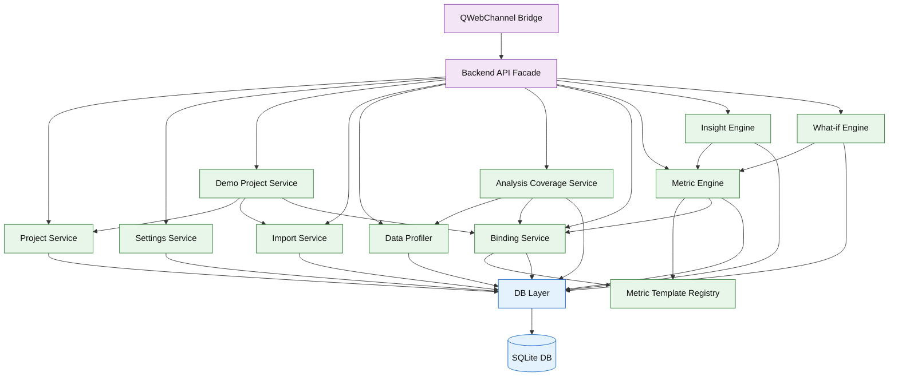
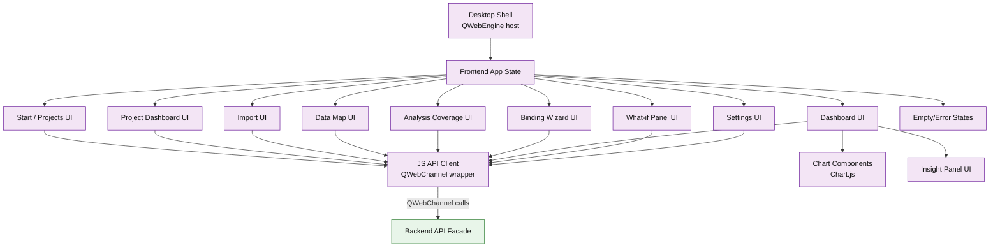
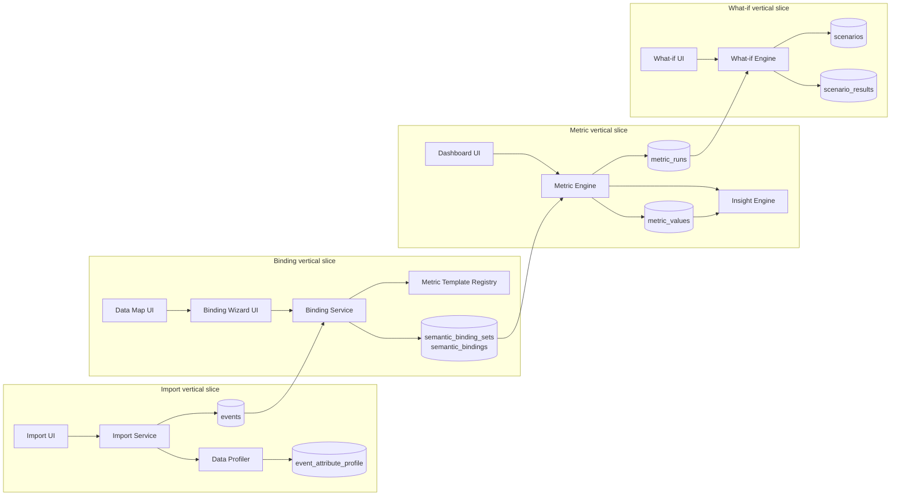
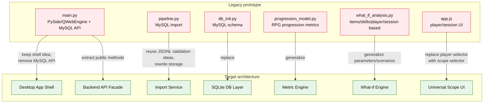

# Diagram: Architecture Components

Дата: 2026-07-02  
Статус: рабочая Mermaid-диаграмма для Obsidian  
Связанный документ: `../18_architecture_overview.md`

## 1. Backend components

## 2. Frontend components

## 3. Component groups by vertical slice

## 4. Legacy migration component view

## Notes

- `progression_model.py` может стать основой `metric_engine.py`, но только после удаления RPG/MySQL-зависимостей.
- `practical_insights.py` логически ближе всего к сохранению как отдельный `insight engine`.
- Старый player selector должен стать универсальным scope selector.
