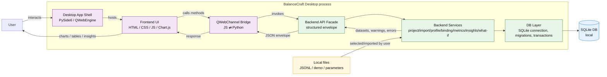
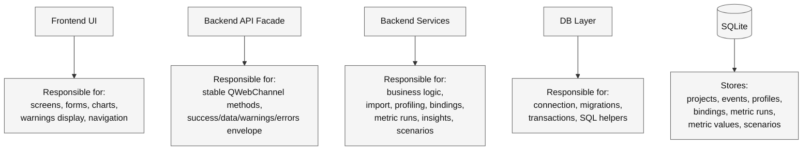
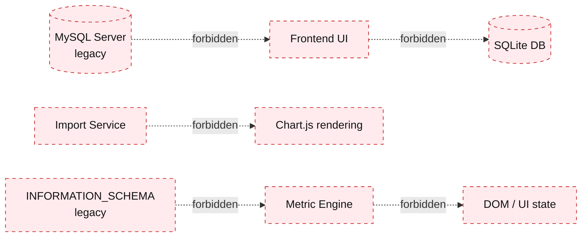

# Diagram: Architecture Container

Дата: 2026-07-02  
Статус: рабочая Mermaid-диаграмма для Obsidian  
Связанный документ: `../18_architecture_overview.md`

## 1. Container diagram — Desktop MVP

## 2. Container responsibilities

## 3. Forbidden container shortcuts

## Notes

- Контейнеры не означают отдельные процессы.
- MVP остаётся desktop-монолитом, но с внутренними архитектурными слоями.
- Главный запрет: UI не должен напрямую зависеть от SQL или старой MySQL-модели.
