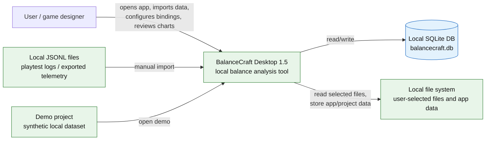
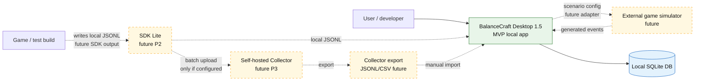
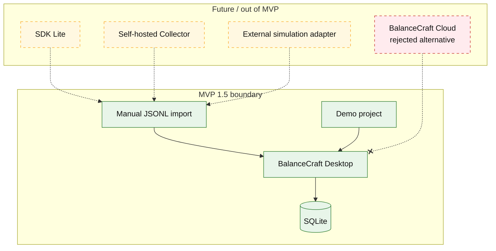

# Diagram: Architecture Context

Дата: 2026-07-02  
Статус: рабочая Mermaid-диаграмма для Obsidian  
Связанный документ: `../18_architecture_overview.md`

## 1. System context — MVP 1.5

## 2. System context — future extensions

## 3. Context boundaries

## Notes

- BalanceCraft Cloud не является целевым компонентом.
- SDK Lite и Self-hosted Collector показаны только для архитектурной совместимости.
- Единственный runtime-storage MVP — локальный SQLite.
