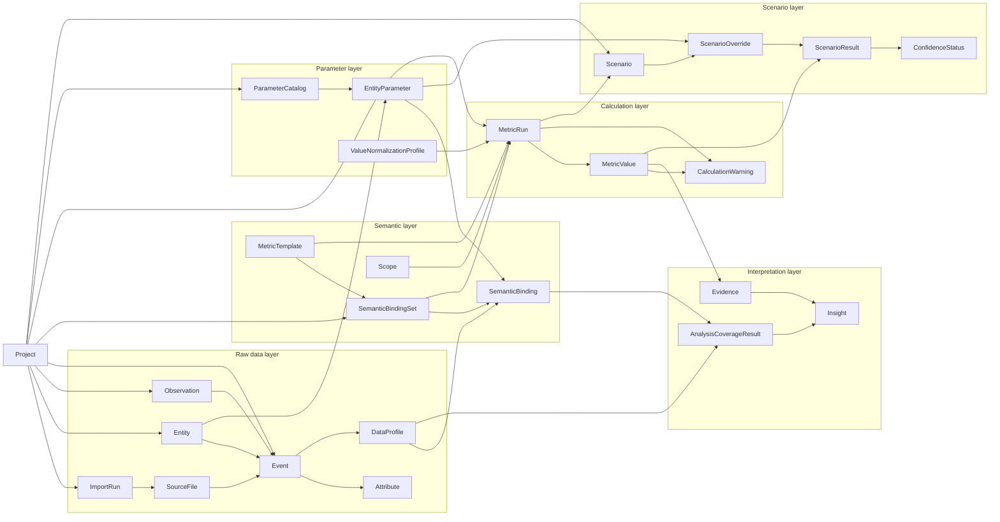
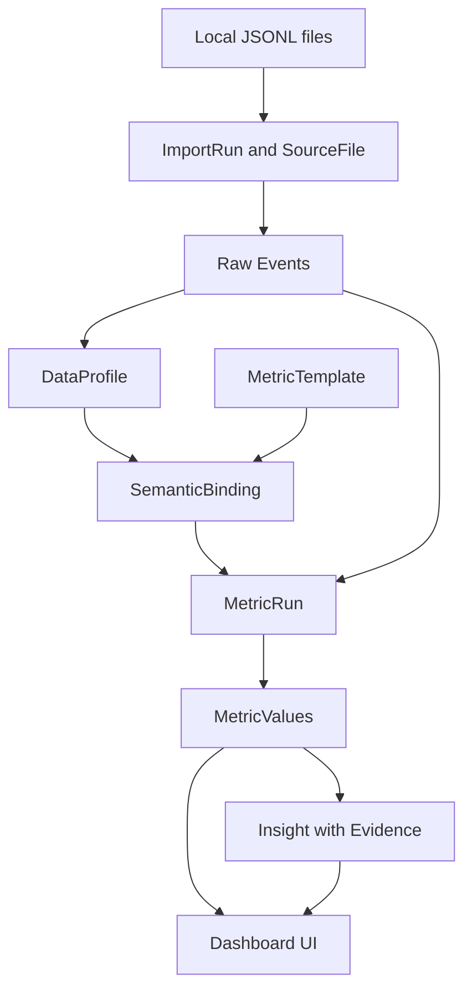
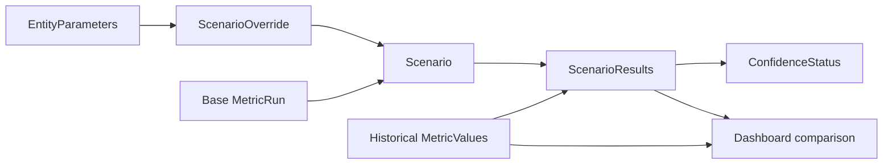
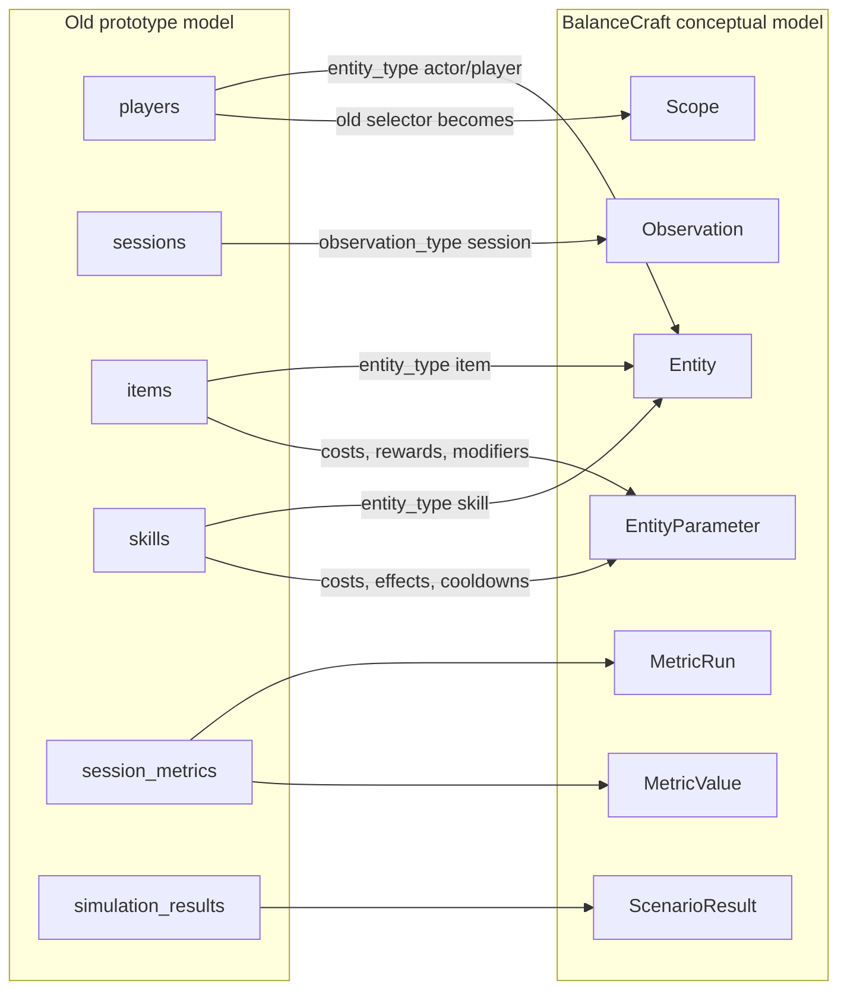

# Conceptual Data Model Diagram

Дата: 2026-07-02  
Статус: draft  
Связанный документ: [`../19_data_model_concept.md`](../19_data_model_concept.md)

---

## Назначение

Эта диаграмма показывает концептуальную модель данных BalanceCraft до физической SQLite-схемы.

Она отвечает на вопрос:

```text
Какие предметные сущности существуют в BalanceCraft
и как они связаны между собой на уровне смысла?
```

Это не физическая ERD. Здесь не фиксируются SQLite-типы, индексы, nullable-поля и конкретные constraints.

---

## Быстрая карта модели



---

## Концептуальная ER-диаграмма

```mermaid
erDiagram
    PROJECT ||--o{ IMPORT_RUN : has
    PROJECT ||--o{ ENTITY : has
    PROJECT ||--o{ OBSERVATION : has
    PROJECT ||--o{ EVENT : has
    PROJECT ||--o{ SEMANTIC_BINDING_SET : has
    PROJECT ||--o{ METRIC_RUN : has
    PROJECT ||--o{ PARAMETER_CATALOG : has
    PROJECT ||--o{ SCENARIO : has

    IMPORT_RUN ||--o{ SOURCE_FILE : includes
    IMPORT_RUN ||--o{ EVENT : imports
    SOURCE_FILE ||--o{ EVENT : provides

    ENTITY ||--o{ EVENT : is_primary_subject_of
    OBSERVATION ||--o{ EVENT : groups
    EVENT ||--o{ ATTRIBUTE : contains

    PROJECT ||--o{ DATA_PROFILE : derives
    DATA_PROFILE ||--o{ SEMANTIC_BINDING : provides_candidates_for

    METRIC_TEMPLATE ||--o{ SEMANTIC_BINDING_SET : configured_by
    SEMANTIC_BINDING_SET ||--o{ SEMANTIC_BINDING : contains
    METRIC_TEMPLATE ||--o{ METRIC_RUN : is_used_by
    SEMANTIC_BINDING_SET ||--o{ METRIC_RUN : is_snapshotted_by
    SCOPE ||--o{ METRIC_RUN : configures

    METRIC_RUN ||--o{ METRIC_VALUE : produces
    METRIC_RUN ||--o{ CALCULATION_WARNING : reports
    METRIC_VALUE ||--o{ CALCULATION_WARNING : may_have

    METRIC_RUN ||--o{ INSIGHT : generates
    INSIGHT ||--o{ EVIDENCE : is_supported_by
    METRIC_VALUE ||--o{ EVIDENCE : is_referenced_by

    DATA_PROFILE ||--o{ ANALYSIS_COVERAGE_RESULT : informs
    SEMANTIC_BINDING ||--o{ ANALYSIS_COVERAGE_RESULT : affects
    ANALYSIS_COVERAGE_RESULT ||--o{ INSIGHT : may_explain

    PARAMETER_CATALOG ||--o{ ENTITY_PARAMETER : contains
    ENTITY ||--o{ ENTITY_PARAMETER : has
    ENTITY_PARAMETER ||--o{ SCENARIO_OVERRIDE : is_changed_by

    SCENARIO ||--o{ SCENARIO_OVERRIDE : contains
    SCENARIO ||--o{ SCENARIO_RESULT : produces
    METRIC_RUN ||--o{ SCENARIO : can_be_base_for
    METRIC_VALUE ||--o{ SCENARIO_RESULT : is_compared_with
    SCENARIO_RESULT ||--|| CONFIDENCE_STATUS : has

    VALUE_NORMALIZATION_PROFILE ||--o{ METRIC_RUN : may_be_used_by

    PROJECT {
        string project_id
        string name
        string settings
    }

    IMPORT_RUN {
        string import_run_id
        string status
        string diagnostics
    }

    SOURCE_FILE {
        string source_file_id
        string file_name
        string file_hash
    }

    ENTITY {
        string entity_id
        string entity_type
        string label
    }

    OBSERVATION {
        string observation_id
        string observation_type
        string build_id
    }

    EVENT {
        string event_id
        datetime timestamp
        string event_type
        string build_id
    }

    ATTRIBUTE {
        string key
        string value_type
        string value
    }

    DATA_PROFILE {
        string profile_id
        string event_types
        string attribute_stats
    }

    METRIC_TEMPLATE {
        string template_key
        string variables
        string formulas
    }

    SEMANTIC_BINDING_SET {
        string binding_set_id
        string template_key
        string name
        string status
    }

    SEMANTIC_BINDING {
        string binding_id
        string variable_key
        string source_path
        string aggregation
    }

    SCOPE {
        string scope_key
        string grouping
        string filters
    }

    METRIC_RUN {
        string metric_run_id
        string template_key
        string binding_snapshot
        string formula_snapshot
    }

    METRIC_VALUE {
        string metric_value_id
        string metric_key
        number value
        string status
    }

    CALCULATION_WARNING {
        string warning_code
        string message
        string severity
    }

    INSIGHT {
        string insight_id
        string severity
        string recommendation
    }

    EVIDENCE {
        string evidence_id
        string reference_type
        string reference_key
    }

    ANALYSIS_COVERAGE_RESULT {
        string problem_key
        string status
        string missing_signals
    }

    PARAMETER_CATALOG {
        string catalog_id
        string build_id
        string source
    }

    ENTITY_PARAMETER {
        string parameter_key
        string value
        string value_type
        string unit
    }

    VALUE_NORMALIZATION_PROFILE {
        string profile_id
        string value_unit
        string rules
    }

    SCENARIO {
        string scenario_id
        string name
        string confidence_status
    }

    SCENARIO_OVERRIDE {
        string override_id
        string parameter_key
        string override_mode
        string scenario_value
    }

    SCENARIO_RESULT {
        string scenario_result_id
        string metric_key
        number historical_value
        number scenario_value
        string confidence_status
    }

    CONFIDENCE_STATUS {
        string status_key
        string label
        string explanation
    }
```



---

## P0 vertical slice view

Эта схема показывает минимальный путь данных для первого рабочего vertical slice.



---

## What-if conceptual view



---

## Legacy mapping view



---

## Чтение диаграммы

Ключевые правила:

1. `Project` — граница изоляции данных.
2. `Event` и `Attribute` — raw data.
3. `SemanticBinding` назначает смысл, но не меняет raw data.
4. `MetricRun` фиксирует конкретный расчёт и хранит snapshots.
5. `MetricValue` хранит не только число, но и status/warnings.
6. `Insight` обязан иметь evidence.
8. `Scenario` работает через overrides и не меняет историю.
9. `ScenarioResult` обязан иметь confidence status.
10. `Player`, `Session`, `Item`, `Skill` — legacy/user semantics, не ядро.

---

## Что проверять при ревью

- Не слишком ли много концептов для P0.
- Все ли связи понятны без знания старого прототипа.
- Не стоит ли перенести `ValueNormalizationProfile` только в P1/P2-секцию документации.
- Достаточно ли ясно, что `Scope` может быть физически JSON-объектом, а не отдельной таблицей.
- Нужно ли уже сейчас предусматривать multiple entity refs для одного event.
- Удобно ли читать диаграммы в Obsidian.
