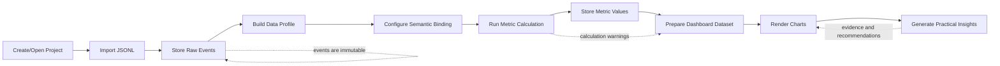
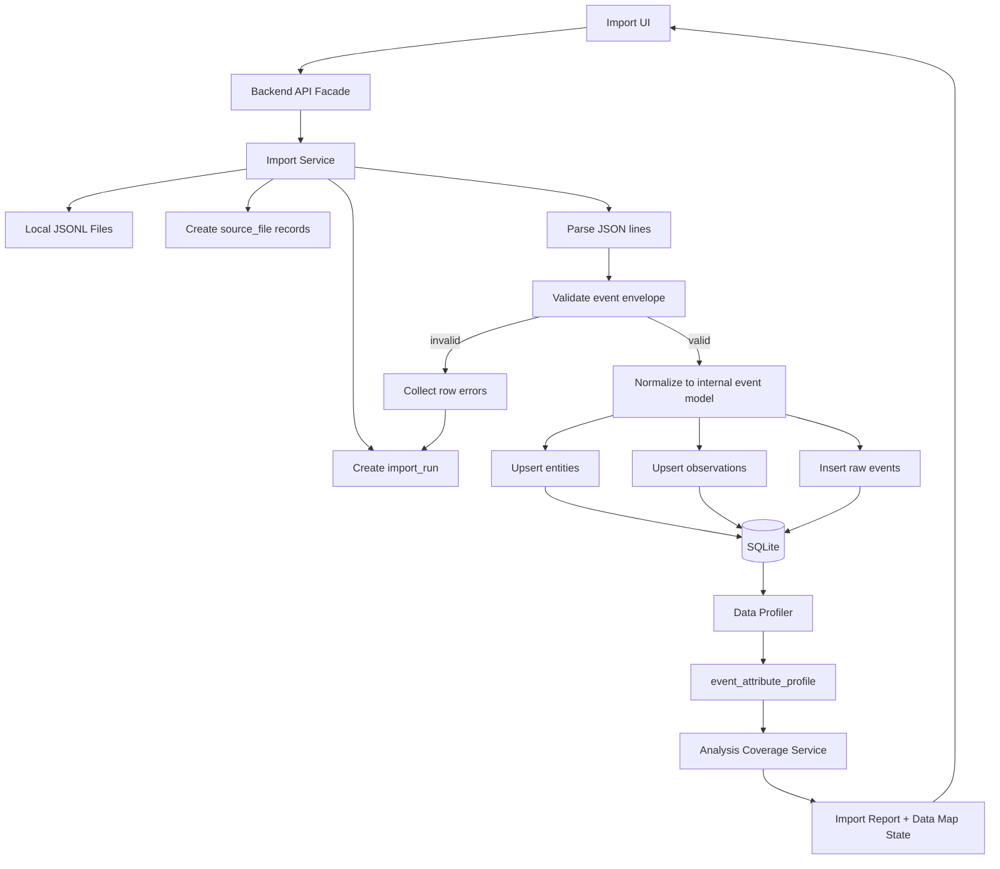
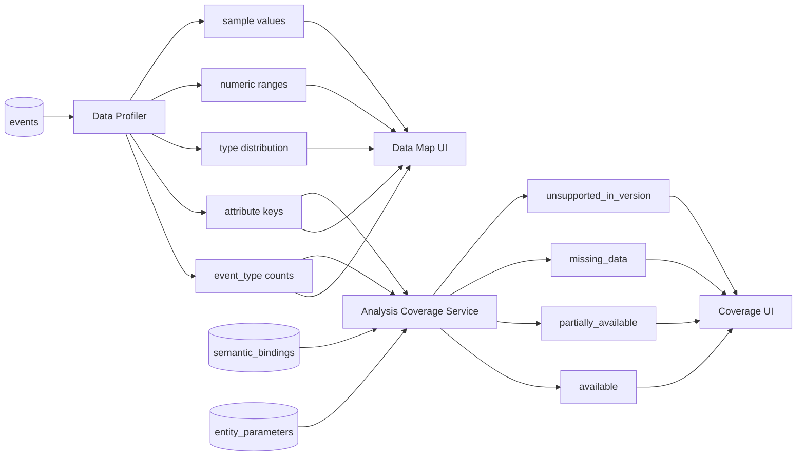
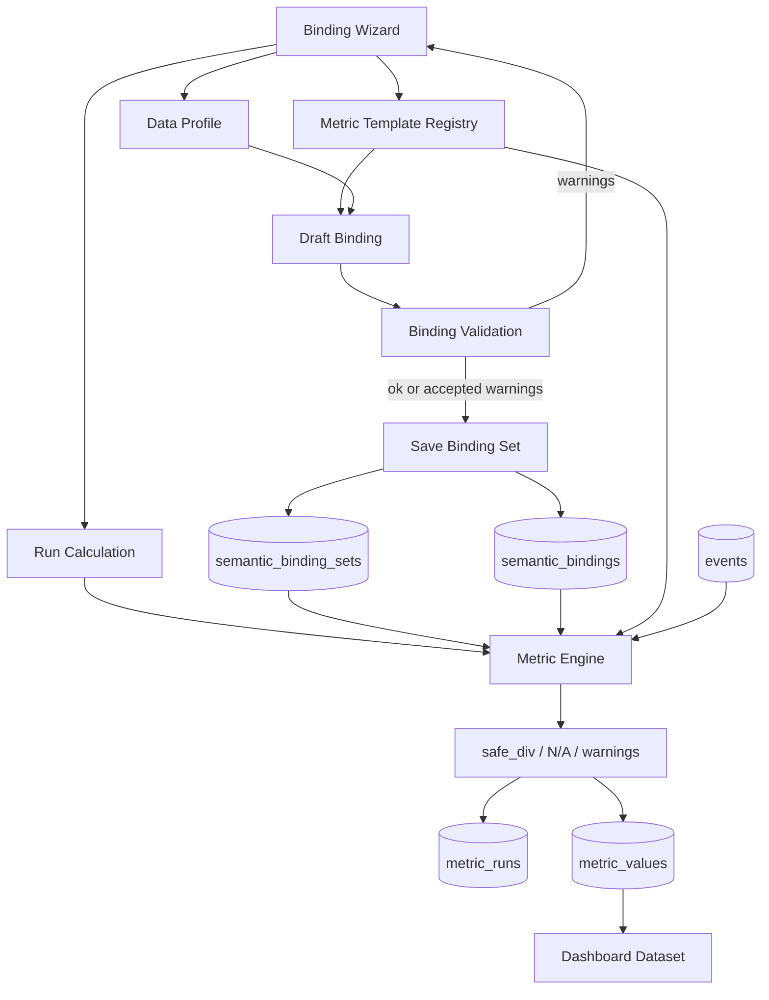
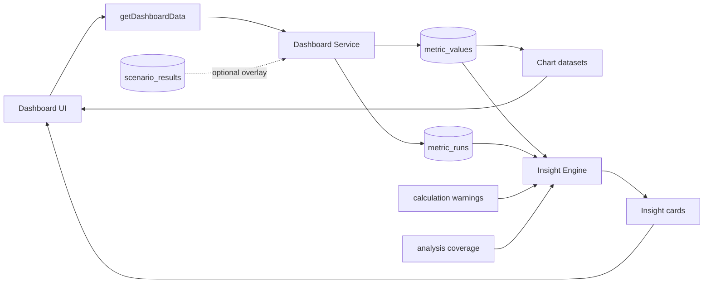
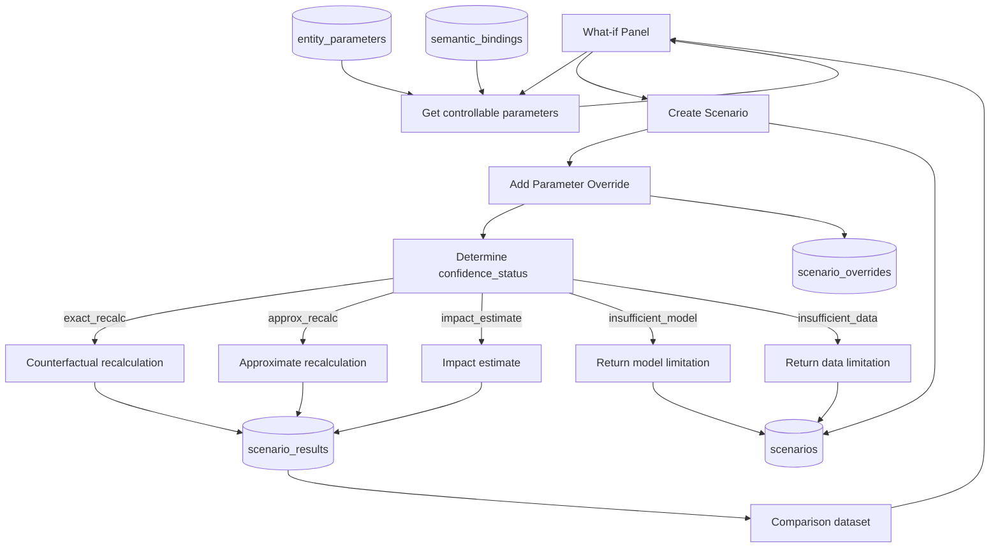
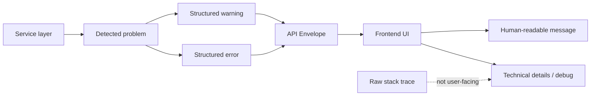

# FILE: `03_design_docs/diagrams/core_data_flows.md`
# Core data flow diagrams

Дата: 2026-07-02  
Статус: рабочий черновик для Obsidian/Mermaid

## 1. P0 vertical slice

## 2. Import and profiling flow

## 3. Data map and analysis coverage

## 4. Semantic binding to metric run

## 5. Dashboard and insights

## 6. Simple What-if flow

## 7. Error and warning propagation

