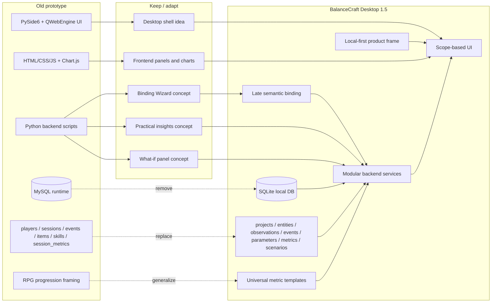
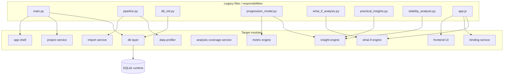
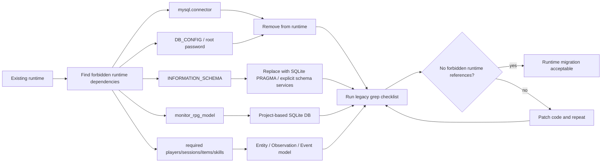
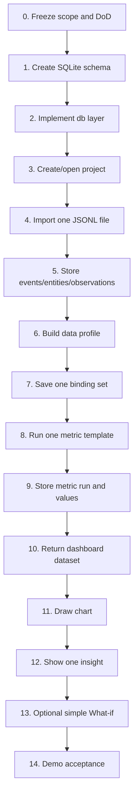
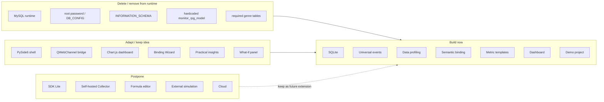
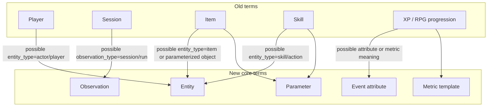

# FILE: `docs/diagrams/migration_overview.md`

# Migration Overview Diagrams

Дата: 2026-07-02  
Статус: рабочий проектный документ

## Назначение

Этот файл показывает миграцию BalanceCraft от старого учебно-дипломного прототипа к новой архитектуре BalanceCraft Desktop 1.5.

Главная мысль:

```text
Мы не “допиливаем MySQL RPG progression analyzer”.
Мы переносим доказанные UI/аналитические идеи в новое local-first ядро.
```

## 1. High-level migration map



## 2. Data model migration

```mermaid
erDiagram
  OLD_PLAYERS {
    int id
    string name
  }

  OLD_SESSIONS {
    int id
    int player_id
    datetime started_at
  }

  OLD_ITEMS {
    int id
    string item_name
  }

  OLD_SKILLS {
    int id
    string skill_name
  }

  OLD_EVENTS {
    int id
    int player_id
    int session_id
    string event_type
    json payload
  }

  OLD_SESSION_METRICS {
    int id
    int session_id
    float metric_value
  }

  NEW_ENTITIES {
    int id
    string entity_id
    string entity_type
  }

  NEW_OBSERVATIONS {
    int id
    string observation_id
    string observation_type
  }

  NEW_EVENTS {
    int id
    string entity_id
    string observation_id
    string event_type
    json attributes_json
  }

  NEW_ENTITY_PARAMETERS {
    int id
    string entity_id
    string parameter_key
    string value
  }

  NEW_METRIC_RUNS {
    int id
    string template_key
    json binding_snapshot_json
  }

  NEW_METRIC_VALUES {
    int id
    int metric_run_id
    string metric_key
    float value
    string status
  }

  OLD_PLAYERS ||--o{ OLD_SESSIONS : owns
  OLD_PLAYERS ||--o{ OLD_EVENTS : produces
  OLD_SESSIONS ||--o{ OLD_EVENTS : groups
  OLD_SESSIONS ||--o{ OLD_SESSION_METRICS : aggregates

  OLD_PLAYERS -. becomes_entity_type_actor .-> NEW_ENTITIES
  OLD_SESSIONS -. becomes_observation_type_session .-> NEW_OBSERVATIONS
  OLD_ITEMS -. becomes_entity_type_item_or_parameterized_entity .-> NEW_ENTITIES
  OLD_SKILLS -. becomes_entity_type_skill_or_action .-> NEW_ENTITIES
  OLD_EVENTS -. becomes_neutral_event .-> NEW_EVENTS
  OLD_SESSION_METRICS -. replaced_by_metric_runs_values .-> NEW_METRIC_RUNS
  OLD_SESSION_METRICS -. replaced_by_metric_runs_values .-> NEW_METRIC_VALUES

  NEW_ENTITIES ||--o{ NEW_EVENTS : referenced_by_entity_id
  NEW_OBSERVATIONS ||--o{ NEW_EVENTS : referenced_by_observation_id
  NEW_ENTITIES ||--o{ NEW_ENTITY_PARAMETERS : has
  NEW_METRIC_RUNS ||--o{ NEW_METRIC_VALUES : produces
```

## 3. Module migration map



## 4. Runtime dependency cleanup



## 5. Vertical slice migration order



## 6. What gets deleted, adapted, and postponed



## 7. Legacy terminology migration



## Review checklist

```text
[ ] Диаграммы не создают впечатление, что старую БД нужно мигрировать “как есть”.
[ ] MySQL явно показан как runtime dependency to remove.
[ ] players/sessions/items/skills не исчезают из мира вообще, но перестают быть ядром.
[ ] Vertical slice начинается с SQLite и заканчивается chart + insight.
[ ] SDK/Collector показаны как future, а не как скрытый MVP scope.
[ ] What-if не выглядит как полноценная симуляция игры.
```

## Notes

Эта диаграмма не является планом переноса существующих пользовательских данных. На текущем этапе старый прототип рассматривается как источник идей, UI-направлений и частично переиспользуемых модулей, но не как схема, которую нужно механически сохранить.
