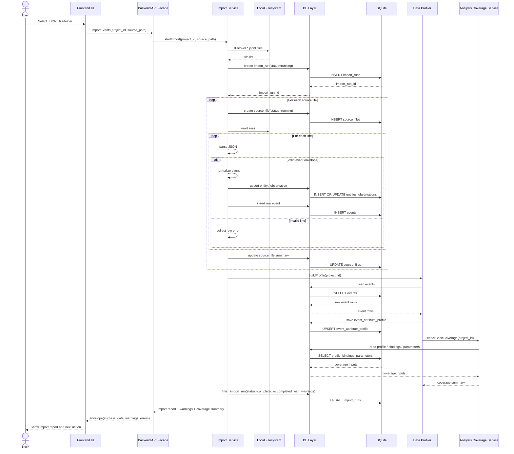

# FILE: `docs/diagrams/sequence_import.md`

# Sequence diagram — JSONL import and profiling

Дата: 2026-07-02  
Статус: рабочий черновик для Obsidian/Mermaid

## Назначение

Диаграмма показывает основной путь импорта JSONL, сохранения raw-событий, профилирования данных и возврата import report в UI.

## Notes

- `events` пишутся как raw history и дальше не изменяются.
- Битые строки не обязаны валить весь import run, если есть валидные события.
- Для P0 coverage может считаться на лету без записи в `analysis_coverage_cache`.
- Если Import Service не нашёл ни одного валидного события, UI должен показать failed import report, а не пустой dashboard.
