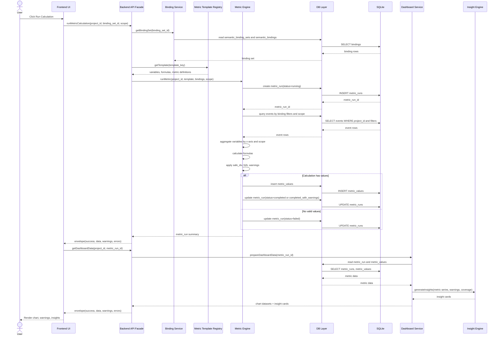

# FILE: `docs/diagrams/sequence_metric_run.md`

# Sequence diagram — metric run and dashboard

Дата: 2026-07-02  
Статус: рабочий черновик для Obsidian/Mermaid

## Назначение

Диаграмма показывает путь от сохранённого semantic binding до рассчитанных metric values, dashboard datasets и practical insights.

## Notes

- `metric_runs.binding_snapshot_json` и `metric_runs.formula_snapshot_json` нужны, чтобы старые результаты не менялись после правки binding/template.
- `safe_div` не подменяет нулевой знаменатель на `1`. Для такой точки должен быть `N/A` или warning.
- Dashboard получает уже подготовленные datasets. Frontend не должен собирать SQL-запросы или самостоятельно интерпретировать raw events.
