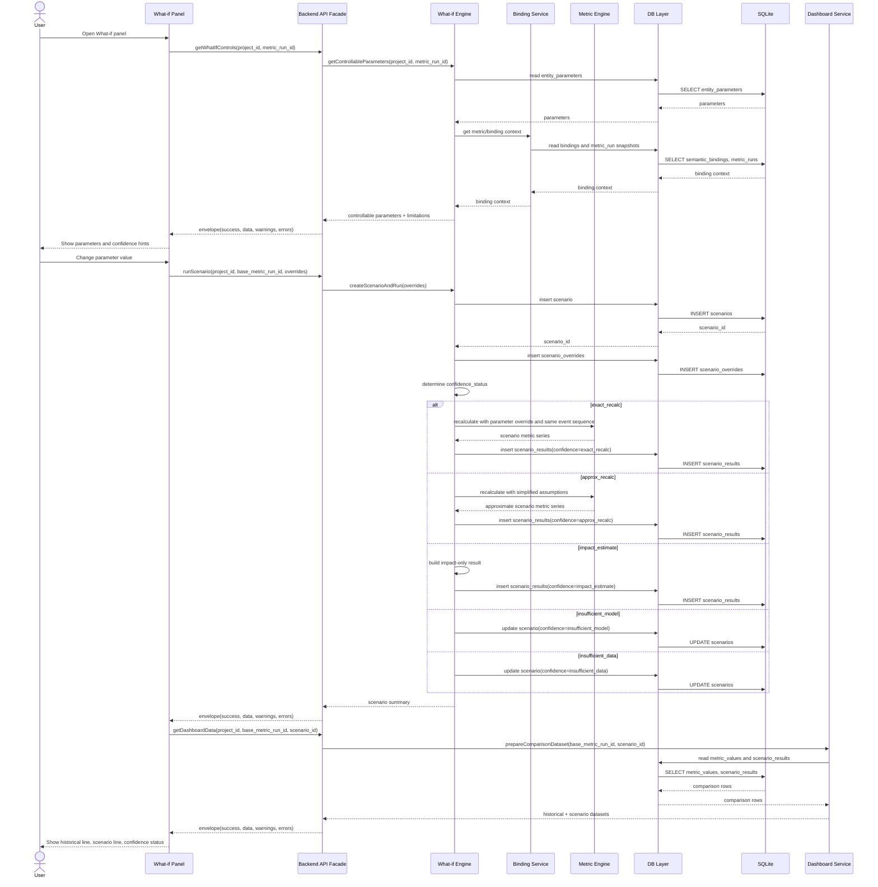

# FILE: `03_design_docs/diagrams/sequence_what_if.md`
# Sequence diagram — simple What-if scenario

Дата: 2026-07-02  
Статус: рабочий черновик для Obsidian/Mermaid

## Назначение

Диаграмма показывает простой параметрический What-if: выбор параметра, сохранение scenario override, определение confidence status, расчёт scenario results и показ сравнения в dashboard.

## Notes

- What-if не меняет `events` и `metric_values`.
- `scenario_results` хранятся отдельно, чтобы не смешивать историю и сценарий.
- MVP не пересимулирует поведение пользователя. Он пересчитывает доступный слой при той же истории событий или честно показывает ограничение.
- `confidence_status` — rule-based статус, а не вероятность и не математическая гарантия.
