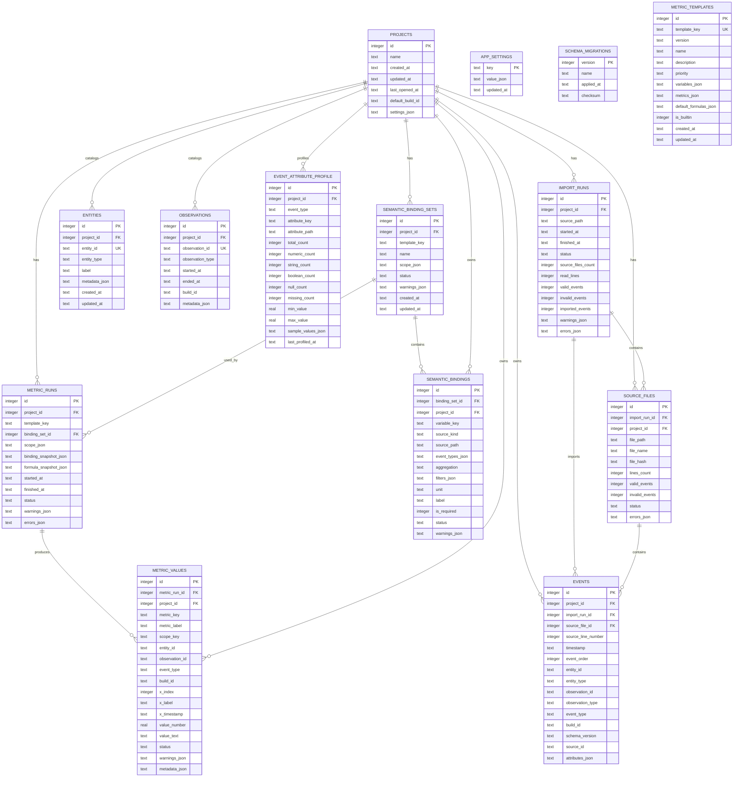
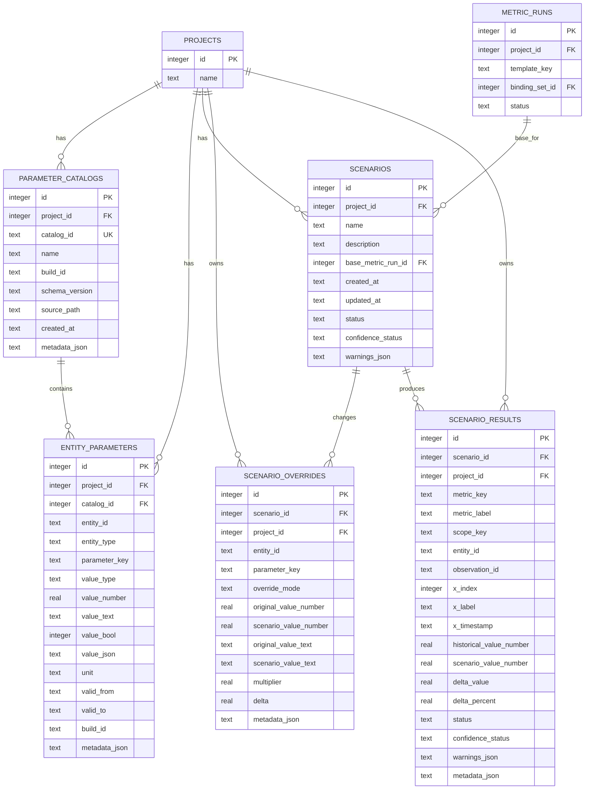
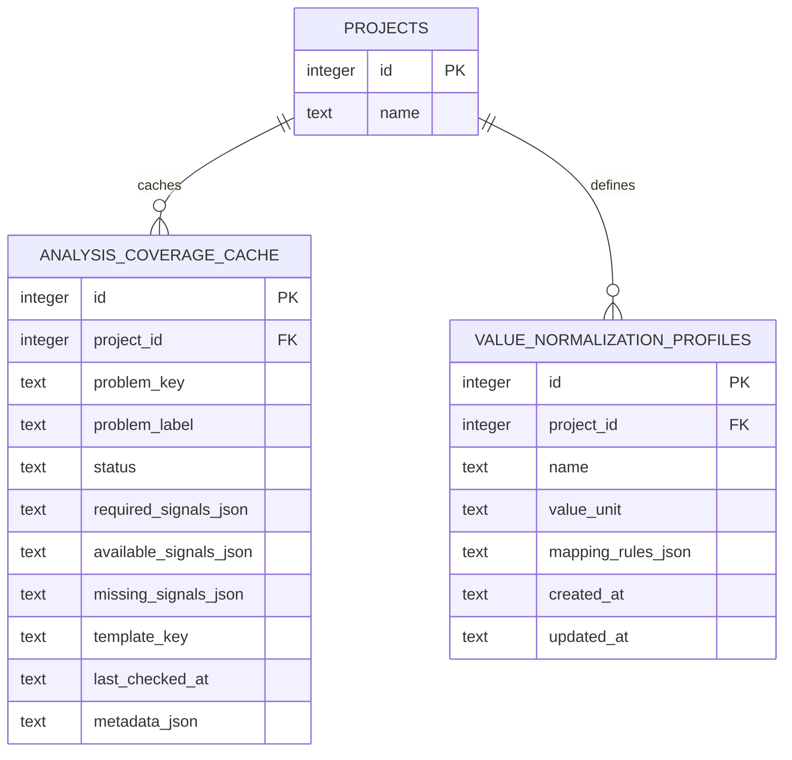
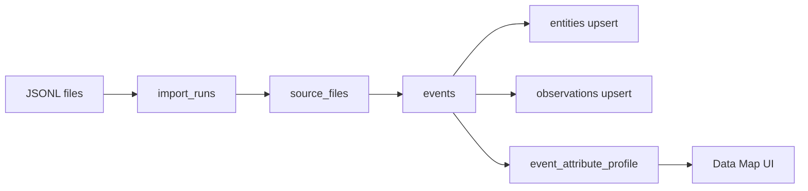
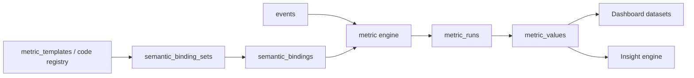
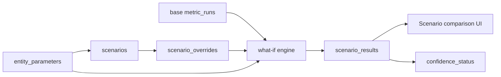
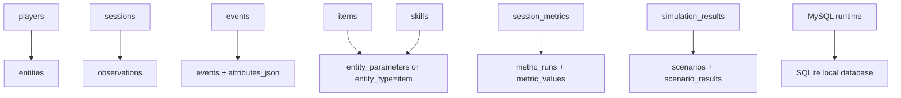

# SQLite ERD diagrams

Дата: 2026-07-02  
Статус: рабочий проектировочный черновик  
Связанный документ: `../20_sqlite_schema_design.md`

## 1. Быстрая карта групп таблиц

```mermaid
flowchart TD
  App[App-level tables] --> Settings[app_settings]
  App --> Migrations[schema_migrations]

  Project[Project core] --> Projects[projects]
  Projects --> Import[Import layer]
  Projects --> Data[Raw data layer]
  Projects --> Binding[Semantic binding layer]
  Projects --> Metrics[Metric layer]
  Projects --> Params[Parameter layer]
  Projects --> Scenarios[What-if layer]
  Projects --> Coverage[Analysis coverage P1]

  Import --> ImportRuns[import_runs]
  Import --> SourceFiles[source_files]

  Data --> Entities[entities]
  Data --> Observations[observations]
  Data --> Events[events]
  Data --> Profile[event_attribute_profile]

  Binding --> BindingSets[semantic_binding_sets]
  Binding --> SemanticBindings[semantic_bindings]
  Binding --> Templates[metric_templates]

  Metrics --> MetricRuns[metric_runs]
  Metrics --> MetricValues[metric_values]

  Params --> ParameterCatalogs[parameter_catalogs]
  Params --> EntityParameters[entity_parameters]
  Params --> ValueNormalization[value_normalization_profiles P1]

  Scenarios --> ScenarioTable[scenarios]
  Scenarios --> Overrides[scenario_overrides]
  Scenarios --> Results[scenario_results]

  Coverage --> AnalysisCoverage[analysis_coverage_cache P1]
```

## 2. P0 physical ERD

### Примечание по ERD

`events.entity_id` и `events.observation_id` являются soft relationships к `entities.entity_id` и `observations.observation_id` внутри одного `project_id`.

Mermaid ERD выше не показывает soft relationship как FK, потому что в P0 это не жёсткая ссылочная связь.

## 3. Parameters + What-if ERD

## 4. P1 extension ERD

## 5. Import and profiling slice

## 6. Metric calculation slice

## 7. What-if slice

## 8. Legacy mapping reminder

## 9. Что важно помнить при чтении диаграмм

- `entities` и `observations` — универсальные справочники, а не обязательные игроки/сессии.
- `events.attributes_json` — raw payload, не нормализованный attribute warehouse.
- `event_attribute_profile` — карта данных, а не источник истины.
- `metric_values.project_id` — намеренная денормализация.
- What-if не меняет `events` и `metric_values`.
- `analysis_coverage_cache` и `value_normalization_profiles` — P1, не обязательный P0.

