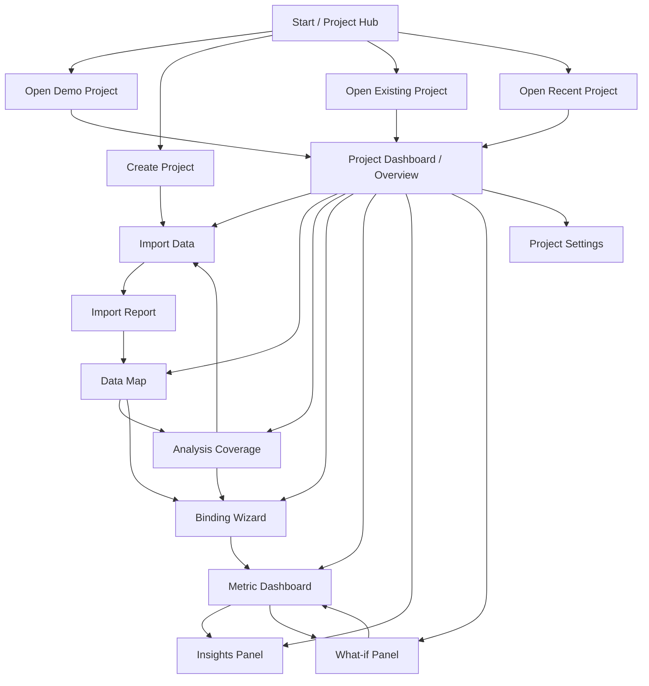
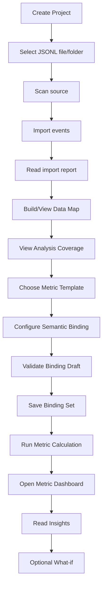
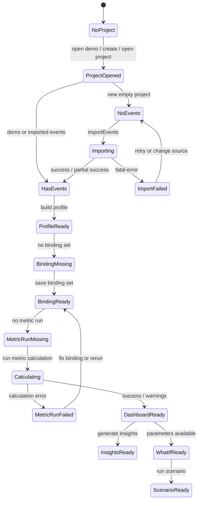
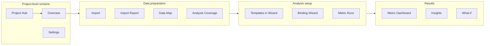
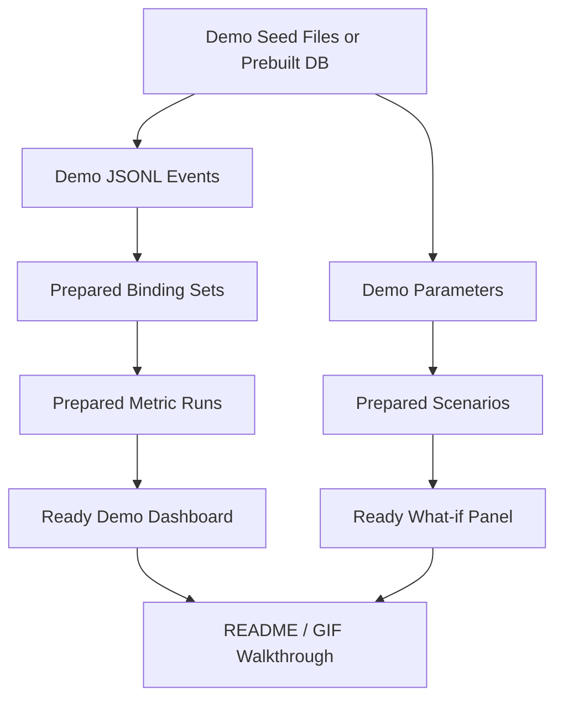
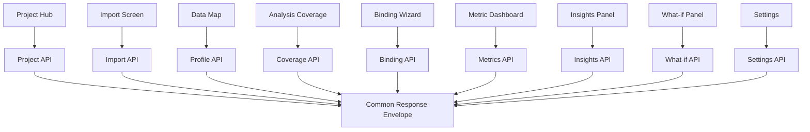

# FILE: `03_design_docs/diagrams/ui_flow.md`
# UI Flow Diagrams

Дата: 2026-07-02  
Статус: проектный черновик для ревью

## Назначение

Этот файл содержит Mermaid-диаграммы пользовательского потока BalanceCraft Desktop 1.5.

Связанный документ: `../23_ui_flow_and_screen_map.md`.

## 1. Main UI flow



## 2. First launch demo walkthrough

```mermaid
flowchart LR
  Launch[Launch App]
  OpenDemo[Click Open Demo Project]
  ReadyDashboard[Ready Dashboard]
  DataMap[Inspect Data Map]
  Binding[Inspect Binding Wizard]
  RunMetric[Run Metric Calculation]
  Insight[Read Insight]
  Scenario[Run What-if Scenario]
  Compare[Compare Historical vs Scenario]

  Launch --> OpenDemo --> ReadyDashboard --> DataMap --> Binding --> RunMetric --> Insight --> Scenario --> Compare
```



## 3. User project happy path



## 4. Screen state progression



## 5. Navigation grouping



## 6. Demo project internal flow



## 7. UI calls backend contract map



## 8. MVP vs future UI boundary

```mermaid
flowchart TB
  subgraph MVP[BalanceCraft Desktop 1.5 UI]
    Hub[Project Hub]
    Demo[Demo Project]
    Import[JSONL Import]
    DataMap[Data Map]
    Binding[Binding Wizard]
    Dashboard[Metric Dashboard]
    Insights[Insights]
    WhatIf[Simple What-if]
  end

  subgraph Future[Future UI / Not MVP]
    Accounts[Accounts / Cloud Auth]
    CollectorAdmin[Collector Admin UI]
    SDKConfig[SDK Configuration UI]
    BI[Full BI Dashboard Builder]
    FormulaEditor[Custom Formula Editor]
    VisualModel[Visual Economy Model Editor]
  end

  MVP -. not in 1.5 .-> Future
```
